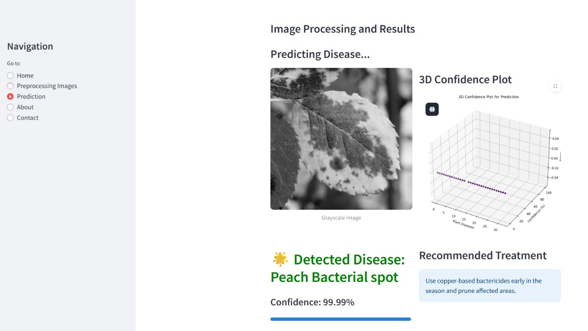

# 🌿 Plant Disease Detection

## 📖 About the Project

**Plant Disease Detection** is a deep learning application designed to identify and classify **33 different types of leaf diseases** from images. The goal is to provide a fast, efficient, and user-friendly tool that helps farmers, agronomists, and agricultural researchers to detect diseases early, reduce crop loss, and improve yield.

This system is powered by **transfer learning**, utilizing pre-trained CNN architectures like VGG16, ResNet, or EfficientNet. The web-based interface is built with **Streamlit**, allowing users to upload images and get predictions instantly.

---

### 🔍 Key Features:
- Detects **33 plant leaf diseases**
- User-friendly **Streamlit web app**
- Uses **pre-trained CNNs** for high accuracy
- **OpenCV** used for image preprocessing
- Easy to deploy and extend


## 🚀 Tech Stack & Tools


---

## 📁 Project Structure
```
├── API/       # Contains API-related scripts or modules
├── Media/     # Store media assets (images, screenshots, etc.)
├── Training/  # Contains model training scripts and notebooks
├── .gitignore # Specifies intentionally untracked files to ignore
├── README.md  # Project documentation
├── app.py     # One version of the Streamlit/Flask app
├── app1.py    # Possibly an alternate or test version of the app
├── main.py    # Main Streamlit app (entry point)
├── webapp.py  # Additional or legacy web app version
├── requirements.txt # List of Python dependencies

```
---

📚 Dataset
The dataset contains:

Images of healthy and diseased leaves

33 labeled categories

Preprocessed for training and evaluation

📌 Future Scope
Integration with mobile camera apps

Real-time disease alert systems

Integration with weather data and soil info for precision agriculture

## 📦 Installation & Usage

1.Clone the repo and install dependencies:
```bash
pip install -r requirements.txt
```
2.Run the app using Streamlit:
```
streamlit run main.py
```
**Note:** The key Python package versions used are specified in `requirements.txt`, including: tensorflow>=2.3.1, numpy>=1.18.5, keras>=2.4.3, streamlit>=1.27.1, opencv-python>=4.7.0.68, matplotlib>=3.3.2, scikit-learn>=0.9, and flask>=1.1.2.

## 🖼 Workflow & Results

### 1️⃣ Preprocessing
This image shows the preprocessing steps applied to the input leaf images, such as resizing, normalization, and augmentation:


### 2️⃣ Prediction
This image shows a sample prediction output from the model after uploading a leaf image:



🙋‍♀️ Author
Made with ❤️ by Deepika

Feel free to connect or contribute!

